---
# try also 'default' to start simple
theme: seriph
# random image from a curated Unsplash collection by Anthony
# like them? see https://unsplash.com/collections/94734566/slidev
background: https://res.cloudinary.com/practicaldev/image/fetch/s--UULjRjwS--/c_imagga_scale,f_auto,fl_progressive,h_900,q_auto,w_1600/https://thepracticaldev.s3.amazonaws.com/i/ss88armov887l9u5dgxj.jpg
# apply any windi css classes to the current slide
class: 'text-center'
# https://sli.dev/custom/highlighters.html
highlighter: shiki
# show line numbers in code blocks
lineNumbers: false
# some information about the slides, markdown enabled
info: |
  ## Slidev Starter Template
  Presentation slides for developers.

  Learn more at [Sli.dev](https://sli.dev)
# persist drawings in exports and build
drawings:
  persist: false
---

# Clean Architecture - C6 & C7

Programación Funcional

Principio de Responsabilidad Única

---
layout: center
class: text-center
---

# Capítulo 6: Programación Funcional

---

# Programación Funcional

Caso: Imprimir los cuadrados de los primeros 25 números enteros

  

  <h4>En Java (orientado a objetos):</h4>
   
  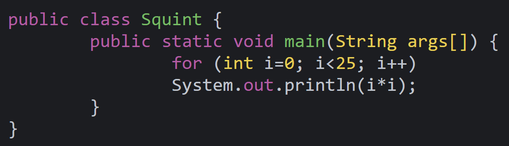
  
Usa una variable <b>mutable</b>: Una variable que cambia su estado en la ejecución del programa

  

  

  <h4>En Clojure (funcional):</h4>
   
  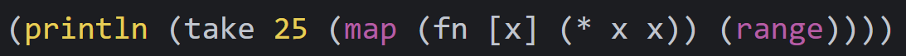
   
  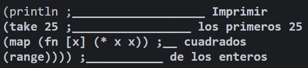
  
<b>No usa</b> variables mutables: La variable x es inicializada, pero nunca modificada

  

Esto nos lleva a una <b>afirmación</b>: Las variables en los lenguajes funcionales no varían.

---

# Inmutabilidad y arquitectura

¿Por qué un arquitecto se preocuparía por la mutabilidad de las variables?

- Porque todas los problemas de <b>condicion de secuencia</b>, <b>condicion de bloqueo</b> y <b>actualizaciones concurrentes</b> son debido a variables mutables.

-> Todos los problemas que surgen en aplicaciones concurrentes, que requieren múltiples hilos y procesos, no ocurrirían si no hay variables mutables.
 
 
 

<v-click>

Desde el punto de vista de arquitecto es importante, éste quiere diseñar sistemas robustos que soporten múltiples hilos y procesos.

¿Se puede mantener siempre la inmutabilidad?

<ul><li>Si, pero solo con <b>infinito almacenamiento y velocidad de procesamiento.</b></li></ul>
</v-click>

---

# Segregación de mutabilidad

Se refiere a separar los servicios dentro de la aplicación en componentes mutables e inmutables.

Los componentes inmutables realizan sus tareas de forma funcional, sin utilizar mutaciones. Estos se comunican con uno o más componentes que son mutables, y que permiten que el estado de las variables cambie.

Es práctica común utilizar una memoria transaccional para proteger las variables mutables de las actualizaciones concurrentes y las condiciones de secuencia.

  
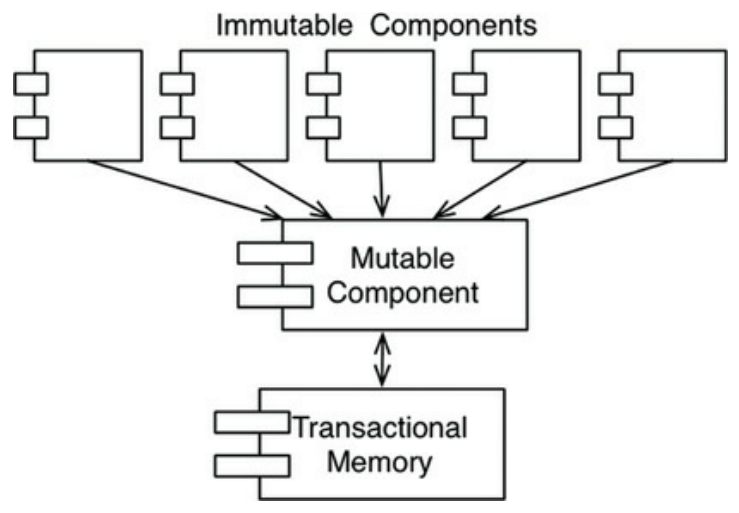

---

# Suministro de eventos

El aprovisionamiento de eventos es una estrategia en la que almacenamos las transacciones, pero no el estado.

Ejemplo: Una aplicación bancaria que, en lugar de almacenar en lugar de almacenar los saldos de las cuentas, y realizar mutaciones en base a depósitos y retiros, almacenamos sólo las transacciones.

Como mejora se puede calcular y guardar el estado cada medianoche, para evitar gran procesamiento y almacenamiento. Para calcular el estado actual, solo se aplican las transacciones desde la medianoche.

  
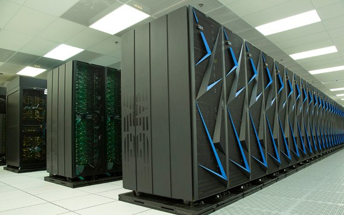

---

# Conclusión

<ul>
  <li>La programación estructurada es una disciplina que se opone a la transferencia directa de control.</li>
  <li>La programación orientada a objetos es la disciplina que se opone a la transferencia indirecta de control.</li>
  <li>La programación funcional es la disciplina que se opone a la asignación de variables.</li>
</ul>
<ul>
<v-click>
  <li>Cada uno restringe algún aspecto de la forma en que escribimos el código. Ninguno de ellos ha aumentado nuestro poder o nuestras capacidades.</li>
  <li>Las reglas del software son las mismas hoy que en 1946, cuando Alan Turing escribió el primer código que se ejecutó en un ordenador electrónico. Las herramientas han cambiado y el hardware también, pero la esencia del software sigue siendo la misma.</li>
</v-click>
</ul>
 
 

 

---
layout: center
class: text-center
---

# Parte 3: Principios de diseño

---

# Principios de diseño

SOLID: Cómo organizar funciones y datos en clases, y cómo esas clases deben estar conectadas.

El objetivo de estos principios es crear estructuras de software que sean: Tolerantes al cambio, fáciles de entender y sean la base de componentes que puedan utilizarse en muchos sistemas de software.

Estos son:
- El principio de responsabilidad única (SRP)
- El principio de apertura y cierre (OCP)
- El principio de sustitución de Liskov (LSP)
- El principio de segregación de interfaces (ISP)
- El Principio de inversión de dependencias (DIP)

  
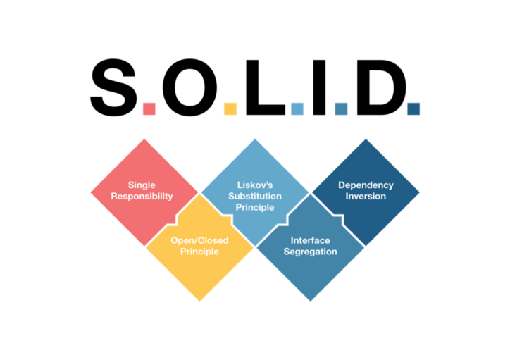

---
layout: center
class: text-center
---

# Capítulo 7: Principio de responsabilidad única (SRP)

---

# Principio de responsabilidad única

Es el principio menos entendido de los 5.

Históricamente fue descrito:
> <b>Un módulo debe tener una, y sólo una, razón para cambiar.</b>

Interpretando que, por razón se refiere a alguna parte interesada, se puede reformular a:
> <b>Un módulo debe ser responsable ante un, y sólo un, usuario o parte interesada.</b>

Agrupamos a los usuarios o stakeholders en una entidad llamada actor. Finalmente:

> <b>Un módulo debe ser responsable ante un, y sólo un, actor.</b>

 
 
 
Existen síntomas que se generan cuando este principio no se respeta:
---

# Síntoma 1: Duplicación accidental

Caso: Clase empleado de un sistema de nóminas, tiene 3 métodos o funciones:
- calculatePay(): Definido por el departamento de contabilidad, que se reporta al CFO.
- reportHours(): Definido y usado por el departamento de RRHH, que se reporta al COO.
- save(): Definido por el administrador de base de datos (DBA), que reporta al CTO.

Esto puede generar que las acciones del equipo del CFO pueden afectar algunas de las que el equipo del COO depende.

     
  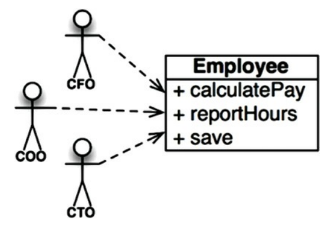

---

# Síntoma 1: Duplicación accidental

1. calculatePay() y reportHours() dependen de una función regularHours() para calcular las horas regulares, esto para evitar duplicar código.
2. El equipo del CFO decide cambiar regularHours(), pero el equipo del COO no está al tanto de esto.
3. Un desarrollador hace el cambio sin percatarse de la dependencia adicional de reportHours().
4. Se prueba y se despliega. RRHH sigue ejecutando sus operaciones pero con números erróneos.
5. Finalmente, los errores han costado miles o hasta millones de dólares al presupuesto de RRHH.

         
  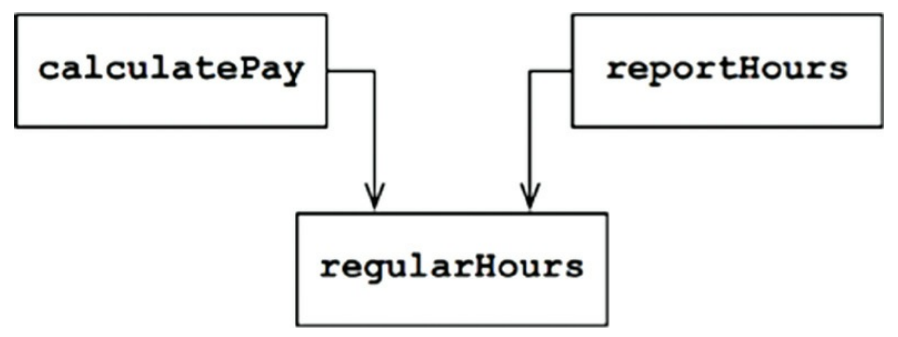

---

# Síntoma 2: Uniones o fusiones (merge)

1. Supongamos que el equipo de DBAs del CTO decide que debe haber un cambio de esquema en la tabla Empleados de la base de datos.
2. Supongamos también que el equipo de equipo del COO decide que necesita un cambio en el formato del informe de horas.
3. Dos desarrolladores diferentes, de equipos diferentes, cambian la clase Empleado.
4. Desgraciadamente sus cambios chocan. El resultado es una fusión o merge.
5. Esta fusión pone en riesgo tanto al CTO como al COO, es posible que al COO también.

<b>La forma de evitar este problema es separar el código que soporta diferentes actores.</b>

---

# Solucion 1

Separa los datos de las funciones.

Las tres clases comparten el acceso a EmployeeData, que es una simple estructura de datos sin métodos.

Cada clase contiene sólo el código fuente necesario para su función particular. Las tres clases no pueden conocerse entre sí.

Así se evita cualquier duplicación accidental.

El inconveniente es que los desarrolladores tienen ahora tres clases que tienen que seguir.

       
  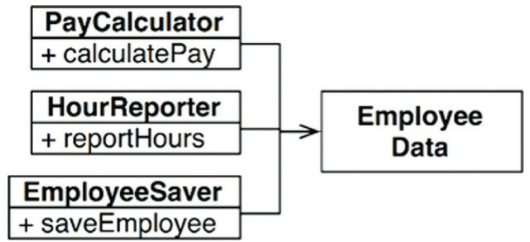

---

# Solucion 1 v2

Una solución común es utilizar el patrón de diseño <b>Facade</b>.

La clase EmployeeFacade contiene muy poco código. Es responsable de instanciar y delegar en las clases con las funciones.

De igual manera, algunos desarrolladores prefieren mantener las reglas de negocio más importantes más cerca de los datos.

         
  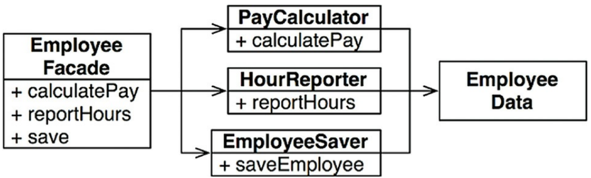

---

# Solucion 2

Esto puede hacerse manteniendo el método más importante en la clase original Empleado y luego usar esa clase como un <b>Facade</b> para las funciones menores.

¿Se podría contradecir a estas soluciones considerando que cada clase debe contart con una sola función?. <b>Difícilmente.</b>

El número de funciones necesarias para calcular la paga, generar un informe, o guardar los datos es probable que sea grande en cada caso. Cada una de esas clases (consideradas un <b>ámbito</b>) tendría muchos métodos privados en ellas.

Fuera de ese fuera de ese ámbito, nadie sabe que los miembros privados de la familia existen.

         
  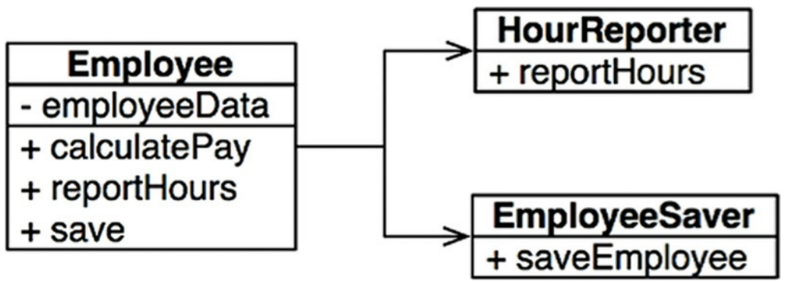

---

# Conclusión

- El Principio de Responsabilidad Única se refiere a las funciones y las clases, pero reaparece de forma diferente en otros dos niveles.
- A nivel de componentes, se convierte en el <i>Principio de Cierre Común</i>.
- En el nivel arquitectónico, se convierte en el <i>Eje de Cambio responsable de la creación de Límites Arquitectónicos</i>, conceptos que se verán en los siguientes capítulos.

---

# Referencias

- [Libro de Clean Architecture](https://ia803101.us.archive.org/9/items/CleanArchitecture/Clean%20Architecture%20A%20Craftsman%27s%20Guide%20to%20Software%20Structure%20and%20Design.pdf)
- [Resaltador de código](https://pinetools.com/syntax-highlighter)
- [Condición de secuencia](https://en.wikipedia.org/wiki/Race_condition)
- [Condición de bloqueo](https://en.wikipedia.org/wiki/Deadlock)
- [Actualizaciones concurrentes](https://www.programmerinterview.com/database-sql/concurrent-update-problem/)

---
layout: center
class: text-center
---

# Muchas Gracias

[Correo](mailto:r.nolasco.ch@gmail.com) · [LinkedIn](https://www.linkedin.com/in/ronaldo-nolasco-chavez/) · [Github](https://github.com/RonaldoNolasco)
